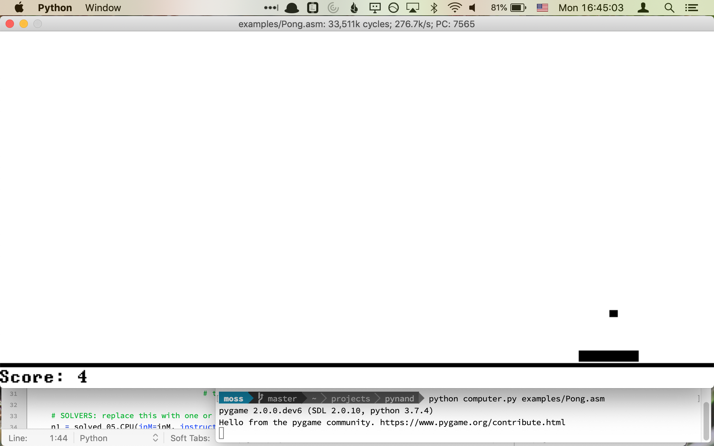

# From Nand to Tetris in Python

An alternative language and test harness for doing the exercises from the amazing book/course
[Nand To Tetris](https://www.nand2tetris.org). This version, in Python, may provide a better
experience as compared to the tools provided by the authors:

* No need to install Java
* No clunky UI
* You only need Python, a text editor, and basic command-line skills
* Able to simulate any similar CPU design at full speed

## Requirements

You need to have Python installed, at least version 3.6.

*Pytest* is required to run the tests: `pip3 install pytest`.

For the full computer simulation including display and keyboard, *Pygame* is required:
`pip3 install pygame`.

And for the best performance, you can install the static compiler *Cython*:
`pip3 install cython`

## Step 1: Do the Exercises

First clone the repo and run `pytest`. All the tests should pass, because the included solutions
are used for every component.

Now open [project_01.py](project_01.py) in a text editor, find the `mkNot` function, and the line
with `solved_01.Not`. Replace that with `Nand(a=..., b=...)` using the inputs so that it computes
the expected result.

Run `./test_01.py`. If `test_not` passes, you can move on to the next component.

When you're all done, delete the line `from nand.solutions import solved_01` at the top of the
file to be sure you didn't miss anything. Actually, if you prefer you can _start_ by deleting that
line, then work on getting the tests to pass one at a time.

That's it for the first chapter. Now move on to `test_02.py`…

### Quit while you're ahead

Although it's fun to complete the entire course to build everything from the chip to the
compiler yourself, you can stop at any time, or indeed implement whichever parts of the
stack that you're most interested in.

The amount of time and code required to complete the projects increases pretty substantially
after the hardware portion (projects 1–5). In particular, projects 8 and 12 may involve
significant code and lots of debugging.

This repo is set up so you only have to work on the projects that interest you; you'll be
running programs on your own designs as soon as you complete a single component in any of the
`project_*.py` modules.

## Step 2: Enjoy

Run `./computer.py examples/Pong.asm`. Bask in the glory of a CPU you built from scratch.
Note: the awesomeness starts after about 4 million cycles.

Depending on your hardware, you might need to use the simulator's options to get a playable
game. Try `./computer.py --help` to get started.

You can also run VM/Jack programs with `./computer.py [dir]`. The test programs for the
compiler are available under [`examples/project_11`](examples/project_11/) (along with Pong in Jack
source form), and the more interesting examples for testing the OS are in
[`examples/project_12`](examples/project_11/).

More interesting/challenging programs can be found on the internet if you're persistent.
Beware: many JACK programs you can find are quite large and may or may not fit in ROM when
the standard compiler/translator are used. I suspect their authors only ever tested them with
the course's included "VM simulator", which doesn't require the program to be translated!
You can try one of the alternative implementations (under [`alt/`](alt/)), several of which are
aimed at supporting large programs.

## Step 3: Go Further

### Your CPU Design

The components here can be used to implement any generally similar CPU design. Ideas:

- Make a fancier ALU. What features do you think would be useful?
- Make a better instruction encoding. How can it do more with less?
- Make an even smaller CPU. What can you take away and still get stuff done?

You can implement alternative designs by providing a new chip, translator, and/or compiler,
and see how they measure up to the authors' original design (and your implementation of it.)

Some experiments can be found in this repo under [alt/](alt/README.md).

### Your Language

What language do you like to write? Can you compile _that_ language, or something like it, to
the Hack VM? Or directly to assembly?

One interesting (and still experimental) alternative language is included: an interactive
interpreter for the Scheme language, ca 1991. See [alt/scheme](alt/scheme/).

## License

This code is open source (MIT License), to the extent that I created it. However, if you want
to base your own work on it you should be aware that the original work is covered by a different
license, and I can provide no advice on the implications.

The entire CPU design, the breakdown of projects, most of the tests, and some example programs
are directly taken from the original
[From Nand to Tetris course materials](https://www.nand2tetris.org/course). Solvers are encouraged
to acquire a copy of the text; many questions are answered there.

All the solutions included in this repo are my own work, but I often compared the results against
the Nand to Tetris Software Suite. I tried to stay close the spirit of the original, but sometimes
strayed when certain choices were especially awkward in a Python context.

The experiments found under `alt/` are my own creations.
