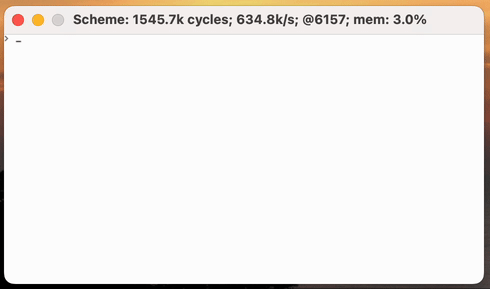

# Scheme

Scheme interpreter, based on [Ribbit](https://github.com/udem-dlteam/ribbit/).

Goals:
- run on the vanilla Hack architecture (well, the CPU anyway)
- provide a REPL that can compile and run simple functions like `fib` or `fact` written at the
  keyboard
- run something graphical (even if in character-mode)
- implement as little as possible in assembly/Jack; just the bare interpreter and Ribbit primitives,
  plus a few additions for accessing the hardware.

## Virtual Machine

A source program is compiled by the Ribbit AOT compiler to an instruction graph as specified in
[A Small Scheme VM, Compiler, and REPL in 4K](http://www.iro.umontreal.ca/~feeley/papers/YvonFeeleyVMIL21.pdf),
with a few modifications.

Additional primitives:
- `peek`; code: `20`; `x ← pop(); r ← RAM[x]`
- `poke`; code: `21`; `y ← pop(); x ← pop(); RAM[x] ← y; r <- y`
- `halt`; code: `22`; stop the machine, by going into a tight loop recognized by the simulator
- `screenAddr`; code: `23`; `y <- pop(); x <- pop(); r <- address of character at (x, y)`

`peek` and `poke` can be used to read and write to any address, but most usefully the screen buffer
(which is at `0x0400`–`0x07E7`) and the location mapped to the keyboard (`0x07FF`).

`halt` can be used to signal normal completion of a program.

`screenAddr` provides a fast implementation of the very common calculation mapping coordinates
to the screen buffer in memory.

Note: `getchar` reads characters one at a time from a buffer which contains up to an entire line.
No characters are returned until `newline` (HACK: 128; Scheme: 10) is entered. As long as a line
hasn't been completed, the backspace key can be used to edit the line by removing the last-entered
character (if any).
However, at present, characters can only be entered after `getchar` has been invoked. While in the
loop receiving keypresses, a "blinking" underscore indicates the cursor position.
This makes `getchar`/`putchar` unsuitable for non-terminal-oriented uses (i.e. games.) Instead, you
can implement your own "keyDown" and "drawChar" operations using `(peek 4095)` and
`(poke (screenAddr x y) c)` (see [io.scm](io.scm)).

## Memory Layout

| Address | Jack                            | Assembly | Description |
|---------|----------------------------------|----------|-------------|
| 0       | `Interpreter.stack`       | `SP`       | Address of the cons list that represents the stack: i.e. a "pair" rib which contains the value at the top of the stack and points to the next entry.                   |
| 1       | `Interpreter.pc`          | `PC`       | Address of the rib currently being interpreted.   |
| 2       | `Interpreter.nextRib`     | `NEXT_RIB` | Address where the next allocation will occur.     |
| ...     |                                  |          | TBD: values used by the garbage collector to keep track of free space. |
| 256–    |                                  |          | Jack stack.                                       |
| 1936–2015 | `Interpreter.bufferStart`/`End` |  | Space to store a line of input from the keyboard. |
| 2016–2047 | `Interpreter.handlers`  |          | Function pointer for each primitive handler.      |
| 2048-4048 |                                | `SCREEN` | Screen buffer: 80x25 characters.                  |
| 4095      |                                | `KEYBOARD` | Mapped to the keyboard for input and "tty" for output. |
| 4096–32767 |                               |          | ROM: interpreter, symbol names, instructions.     |
| 32768–65536 |                              |          | Heap.                                             |

*Note: when the Jack interpreter is used, these locations are determined by the assembler,
addresses 0-15 and are used by the interpreter's own stack pointers and temporary storage, and the
interpreter's own stack grows up from address 256.*

## Rib Representation

For simplicity, ribs are stored as described in the paper, three words each.

The high bit of each "object" word is used as a tag to identify whether the word points to a rib
or represents an unboxed integer.
- Any word with the high bit set is the address of a rib in memory, divided by three and negated.
- A word with the high bit unset contains a signed integer value in the low 15 bits. To recover an
    ordinary 16-bit value when needed, bit 14 is copied to bit 15. For many operations it's
    sufficient to treat values as unsigned and just make sure to clear the high bit if it could
    have become set due to overflow.
- Small integer values that are part of the encoding of ribs are left as is. This includes the
    types of values, instruction opcodes, length of strings and vectors, the number of args for
    closures/procs, and slot numbers.

Therefore, for the purposes of garbage collection, only negative values are identified as pointers
that need to be traced.

Note: Ribbit's C implementation uses the *low* bit to tag integers, but that's not practical on this
CPU, which does not provide a right-shift instruction. Masking off the high bit can be done efficiently.
On the other hand, rib addresses only ever need to be generated incrementally so we only need the
`extract` operation: multiply by -3 (with two "+" instructions and one "negate".)

## Initialization

To make efficient use of available memory, the symbol table and instruction graph produced by
Ribbit's compiler (`rsc.py`) are decoded into ribs and included as "data" words in the ROM, using
[big.py](../big.py)'s extra `#<int>` opcode.

The actual `symbol` ribs that make up the symbol table have to be mutable, so they're constructed
in RAM during initialization. Their addresses are known ahead of time, so the code in ROM refers to
them directly.

Note: the REPL consumes about 2K ribs in memory, and takes about 2KB of encoded data in the Ribbit
implementations. That means to initialize we need something like 6K of heap plus 2K words, plus
some for stack.

Actual size in the implementation:
- Instruction ribs in the ROM for the REPL: 1,340 (4.0K words)
- String/char ribs in R0M for the symbol table: 1,170 (3.5K words)
- Initial ribs in RAM for the symbol table: 89 (267 words)
- Actual total ROM, including interpreter and tables: at least 11K.

[A comment in the Ribbit source](https://github.com/udem-dlteam/ribbit/blob/dev/src/host/c/rvm.c#L207)
suggests that space for 48,000 ribs is needed to bootstrap. Presumably that refers to running the
*compiler*, which is out of scope.

## GC

Two heaps are allocated:

The initial heap occupies ribs `-21844` (address `65532` == `-4`) through `-16384`.
The "spare" heap occupies ribs `-16383` through `-10923` (address `32769` == `-32767`).
Each heap has space for 5,461 ribs.

Because ribs are tracked using negative values, it's easier to think of the heaps as growing
from the largest negative value towards zero. Considering raw addresses as signed values,
that means the bottom of the initial heap is just below 0, and the top of the spare heap is at
the most negative address, just before the address space wraps around to positive values
(at the top of ROM.)

Note: these allocations are based on a total of 32k words of available RAM. If the size of ROM
becomes configurable, they could be expanded to, say, 48k. At that point, the heap(s) will be
wrapping around from positive to negative address ranges, making this arithmetic even more
confusing, but fortunately the tagged rib addresses will always be in a continuous range.

Each time a new rib is allocated, a (tagged) pointer is incremented, starting at the bottom of the
active heap (the most negative tagged pointer) and growing toward the top. When the interpreter
needs to allocate a new rib and there's no space left in the active heap, the garbage collector
is invoked.

Starting with the top entry on the stack and the current instruction as roots, the garbage
collector visits all reachable ribs and copies them to the spare heap. When all reachable ribs
have been copied, the heap pointers are swapped, the spare becomes active, and any space
occupied by un-copied ribs has effectively been reclaimed.

Obviously throwing away half the heap space isn't making very good use of the small available RAM,
but it does keep the code simple. Some tips on more efficient use of memory can be found at
https://github.com/udem-dlteam/ribbit/issues/26.

## Performance

With the current Jack compiler and the `compiled` simulator, performance of the interpreter is good
enough to call interactive. However, if and when we decide to improve it, there are a couple of
obvious bottlenecks:

- Symbol table lookup: the REPL's symbol table is at least 89 deep, and linear search in interpreted
  Scheme is currently consuming a large portion of the total time. Could experiment with a simple tree
  structure, which would be roughly log(90) = 6 levels deep.

- Dispatching on instruction and primitive codes is relatively expensive. Could embed handler pointers
  directly in the ribs? Or just use more codes to flatten the amount of dispatching that's currently
  needed (e.g. separate codes for call slot, call symbol, jump to slot, jump to symbol). Either would
  require modifying the Scheme compiler to account for the new representation.
